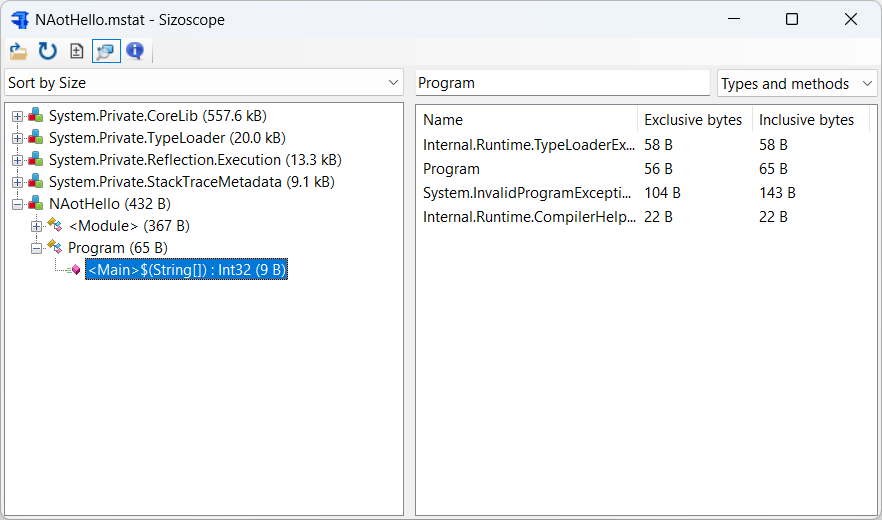
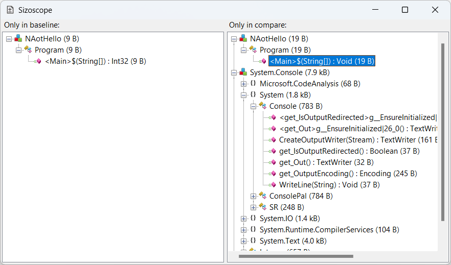
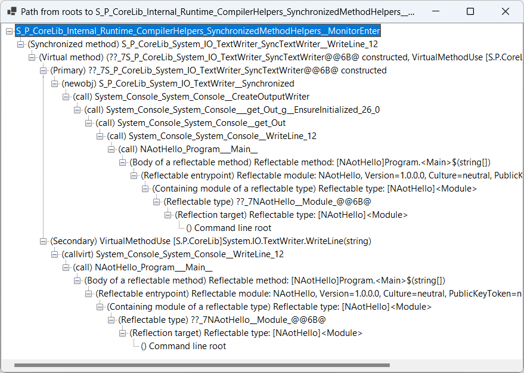

# Sizoscope

Sizoscope is a binary size investigation tool to help you optimize and reduce the size of your .NET Native AOT binaries.

It supports visualizing the size contributions of individual methods and types, but also namespaces and assemblies. It also allows diffing before/after snapshots and offers basic root cause analysis.

## Installing Sizoscope

```shell
$ dotnet tool install sizoscope --global
```

Alternatively, download a release from the [Releases](https://github.com/MichalStrehovsky/sizoscope/releases) tab. The releases on the Releases tab are built with native AOT and are fully standalone/portable ZIPs. They work great under Linux with Wine.

There's an Avalonia-based fork of Sizoscope maintained by @hez2010 [here](https://github.com/hez2010/sizoscopeX).

## Using Sizoscope

The tool only supports the [Native AOT deployment model](https://learn.microsoft.com/dotnet/core/deploying/native-aot/) in .NET 7 or later. After enabling Native AOT deployment on your project as documented in the linked doc (basically, add `<PublishAot>true</PublishAot>` to a `PropertyGroup` in your project), add following lines to the project to enable generation of additional compile-time diagnostic files:

```xml
<PropertyGroup>
  <IlcGenerateMstatFile>true</IlcGenerateMstatFile>
  <IlcGenerateDgmlFile>true</IlcGenerateDgmlFile>
</PropertyGroup>
```

Once you have that, `dotnet publish` your project as usual. After publishing, you should see a *.mstat and *.dgml.xml file under `obj\Release\net[7|8].0\[linux|win]-[x64|arm64]\native` - these are the files Sizoscope operates on.

Launch the tool and open the MSTAT file. The associated *.dgml.xml file will be loaded automatically if it's next to the *.mstat. If the *.dgml.xml doesn't exist, root cause analysis will not work.

Once the file loads, you'll be greeted with the main screen that shows assembly contributions:



You can click around things that look interesting. You can also open the search subwindow where you can sort individual entries by exclusive/inclusive size.

If you have a different MSTAT file you'd like to compare with, click the Diff button to enter a diff view:



The diff view will show you things that are unique to the baseline on the left and things that are unique to the compared MSTAT on the right.

## Root analysis

ℹ️ NOTE: Root analysis is only supported starting in .NET 8. The MSTAT files generated with older SDKs don't have the necessary information.

The main window and the diff window will show you what is in the binary, but not _why_ it's in the binary. Double-clicking a node in the main window or diff window will open a root analysis window. This will try to explain _why_ something was included.



In the above screenshot, the reason why the top node was included in the executable was all the things nested under it. Some nodes have two reasons. This is typical for e.g. virtual method implementations - the reason why a virtual method implementation is generated is that _both_ the virtual method gets called somewhere _and_ a type implementing the method was allocated. The screenshot has one such situation for `SyncTextWriter.WriteLine`.

## Tips and tricks

* Passing a MSTAT file name on the command line will launch Sizoscope with the file open. You can associated *.mstat files with Sizoscope in shell.
* You can drag and drop .mstat files into the UI to open them.
* Holding Alt when dragging and dropping will open a diff against the open file.
* MSTAT files are loaded to memory and the associated file system files are closed. This is done on purpose so that you can quickly do before/after comparisons: simply open the MSTAT, make your change to the project and re-publish, and do a diff _against the same file_.
